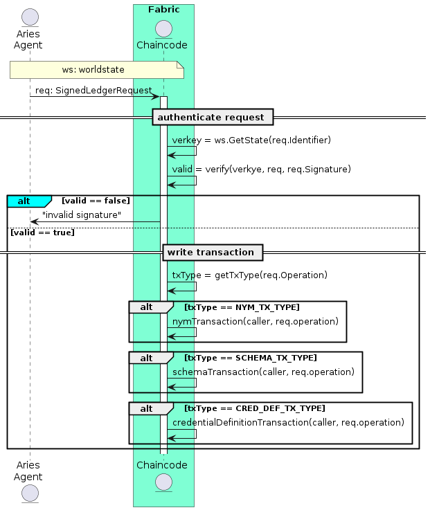

# Fabric Aries

This is a design docs for integrating aries with hyperledger fabric blockchain. Doc will be almost common for other general purpose blockchain (like ethereum, solana, hedera hashgraph) which supports smart contracts.

## Flow



### Aries Agent Authentication

authentication for aries agent making request to ledger.

- Aries agent sends `SignedLedgerRequest` to Ledger (`chaincode`)

```ts
export interface SignedLedgerRequest {
    reqId: number;
    identifier: string; // did of transaction caller
    operation:  {[key: string] : any};
    protocolVersion: number;
    signature: string; // signature of caller with it's private key corresponding to verkey of did caller.
}
```

- Chaincode authenticates caller by verifying signature, flow of signature verification should be:
  - get `did` from worldstate : `getDID(request.identifier)`
  - convert `verkey` to  public key `pub = ed25519.PublicKey(base58.Decode(did.verkey))`
  - decode signature from base58 `sign = base58.Decode(request.signature)`
  - `serialize` message `serialized_message = serialize(request)`
  - verify signature `valid = ed25519.Verify(pub, serialized_message, sign)`


### Chaincode initialization

Chaincode should be initialize with list of `TRUSTEE` :

```json
[
   {
    "alias" : "",
    "dest" : "",
    "verkey" : "",
   } 
]
```

### Registered `TRUSTEE` make `nymTransaction`

- Fabric Client Authentication
- Aries Agent Authentication
- Create new `NYM` if not existing

### Create Schema

- Fabric Client Authentication
- Aries Agent Authentication, role >= `ENDORSER`
- Create new `NYM` if not existing
- ID = `${identifier}:2:${schema.name}:${schema.version}`

### Create Credential Definition

- Fabric Client Authentication
- Aries Agent Authentication, role >= `ENDORSER`
- Create new `NYM` if not existing
- ID = `${identifier}:3:${credDef.signature_type}:${hash64(schemaID)}:${credDef.tag}`


## Chaincode response

**Success**

```json
{
    "op" : "READ" || "WRITE",
    "type" : "1" || "101" || "102", // transaction type
    "identifier" : "7jUk7gMNzBXgZvVGPdDVnx", // did of caller
    "data" : {
        // op and type specific data
    }
}
```

**Error**

```json
{
    "op" : "READ" || "WRITE",
    "type" : "1" || "101" || "102", // transaction type
    "identifier" : "7jUk7gMNzBXgZvVGPdDVnx", // did of caller
    "reason" : "error message"  
}
```